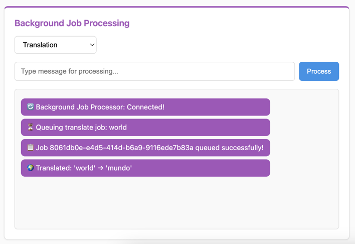

Background Jobs
===============

*Asynchronous Processing with Real-Time Updates*

In this section, we'll integrate background job processing with WebSocket communication. This powerful pattern allows you to offload long-running tasks from WebSocket connections while providing real-time updates when jobs complete.

Understanding Background Jobs with WebSockets
---------------------------------------------

**The Challenge**: WebSocket connections should remain responsive and not block on long-running operations like AI processing, file uploads, or external API calls.

**The Solution**: Use background workers to process jobs asynchronously while maintaining real-time communication with clients through channel layers.

**Key Benefits:**
 - **Non-blocking**: WebSocket stays responsive while jobs run in background
 - **Scalable**: Multiple workers can process jobs concurrently
 - **Real-time Feedback**: Clients receive results immediately when jobs complete
 - **Cross-process Communication**: Workers and WebSocket servers can run on different machines

**Architecture Overview:**
 1. Client sends message to WebSocket consumer
 2. Consumer queues a background job and responds immediately
 3. Background worker processes the job asynchronously
 4. Worker sends results back to client via channel layers
 5. Client receives real-time updates when job completes

Understanding sync_to_async and async_to_sync
---------------------------------------------

When integrating async WebSocket consumers with sync background workers, we need utilities to bridge the synchronous and asynchronous worlds:

**async_to_sync**: Converts async functions to sync (mainly used here)
  - Background workers are typically sync functions
  - Channel layer operations are async, so we wrap them with ``async_to_sync()``
  - Example: ``async_to_sync(channel_layer.send)(channel_name, message)``

**sync_to_async**: Converts sync functions to async
  - Used when calling sync database operations from async consumers
  - Example: ``await sync_to_async(User.objects.get)(id=user_id)``

Both utilities come from ``asgiref.sync`` and are essential for mixing sync/async code in Django-style applications.

Creating Background Tasks
-------------------------

First, let's create our background task definitions. Create a new file at ``sandbox/tasks.py``:

.. raw:: html

   

   
<a>Background Tasks Code</a>

.. literalinclude:: ../../sandbox/tasks.py
   :language: python

.. raw:: html

   

This tasks file provides:

 - **Multiple Job Types**: Translation, text analysis, AI response generation, and default processing
 - **Redis Queue Integration**: Uses RQ (Redis Queue) for job management
 - **Channel Layer Communication**: Jobs send results back to WebSocket clients using ``async_to_sync``
 - **Job Dispatcher**: ``queue_job()`` function routes different job types to appropriate handlers
 - **Error Handling**: Graceful handling of channel layer communication errors

**Key Components:**
 - ``JOB_FUNCTIONS``: Maps job types to processing functions
 - ``_send_result_to_client()``: Uses channel layers to deliver results back to WebSocket
 - ``setup_layers()``: Ensures channel layers are available in worker processes

Creating the Background Worker
------------------------------

Next, create the worker script at ``sandbox/worker.py``:

.. raw:: html

   

   
<a>Background Worker Code</a>

.. literalinclude:: ../../sandbox/worker.py
   :language: python

.. raw:: html

   

This worker script:

- **Monitors Redis Queue**: Continuously polls for new jobs to process
- **Channel Layer Setup**: Initializes Fast Channels layers for result communication
- **Graceful Shutdown**: Handles Ctrl+C and system signals properly
- **Connection Testing**: Verifies Redis connectivity before starting
- **Error Handling**: Provides clear feedback for connection and processing issues

Creating the Development Launcher
---------------------------------

For easier development, create ``sandbox/start_dev.py`` to run both server and worker together:

.. raw:: html

   

   
<a>Development Launcher Code</a>

.. literalinclude:: ../../sandbox/start_dev.py
   :language: python

.. raw:: html

   

This launcher script:

- **Dual Process Management**: Starts both RQ worker and FastAPI server
- **Coordinated Shutdown**: Stops both processes gracefully with Ctrl+C
- **Process Monitoring**: Restarts if either process dies unexpectedly
- **Development Optimized**: Includes live reload for the FastAPI application

Creating the Background Jobs Consumer
-------------------------------------

Now let's create the WebSocket consumer that integrates with our background jobs. First, create the module structure:

.. code-block:: bash

    # Create the background_jobs module directory
    mkdir -p sandbox/apps/background_jobs

    # Create __init__.py file to make it a Python module
    touch sandbox/apps/background_jobs/__init__.py

Create a new file at ``sandbox/apps/background_jobs/consumer.py``:

.. raw:: html

   

   
<a>Background Jobs Consumer Code</a>

.. literalinclude:: ../../sandbox/tutorial/apps/background_jobs/consumer.py
   :language: python

.. raw:: html

   

Understanding the Background Jobs Consumer
------------------------------------------

Let's break down how this consumer works:

**Message Processing:**
  - Accepts both JSON and plain text messages
  - Extracts job type from JSON data (e.g., ``{"type": "translate", "content": "hello"}``)
  - Falls back to "default" job type for plain text

**Job Queuing:**
  - ``queue_job()`` sends work to background queue immediately
  - Returns job ID for tracking
  - Consumer remains responsive during job processing

**Result Handling:**
  - ``job_result()`` method receives results from background workers
  - Background workers use channel layers to send results back
  - Real-time delivery to the specific client that requested the job

**Channel Layer Usage:**
  - Uses "chat" layer (same as room chat) for result communication
  - Background workers send messages to specific channel names
  - Enables cross-process communication between workers and WebSocket server

Integrating the Consumer
------------------------

Connect the background jobs consumer to your FastAPI application. Open ``sandbox/main.py`` and uncomment these lines:

.. code-block:: python

    # Uncomment this import line:
    from sandbox.apps.background_jobs.consumer import BackgroundJobConsumer

    # Uncomment this WebSocket route:
    ws_router.add_websocket_route("/backgroundjob", BackgroundJobConsumer.as_asgi())

These lines add a WebSocket endpoint at ``/ws/backgroundjob`` that handles background job processing.

Testing Your Background Jobs
----------------------------

Your final project structure should now look like this:

.. code-block:: text

    tutorial-project/
    ├── docker-compose.yml
    └── sandbox/
        ├── __init__.py
        ├── main.py
        ├── layers.py
        ├── tasks.py
        ├── worker.py
        ├── start_dev.py
        ├── apps/
        │   ├── __init__.py
        │   ├── background_jobs/
        │   │   ├── __init__.py
        │   │   └── consumer.py
        │   ├── room_chat/
        │   │   ├── __init__.py
        │   │   └── consumer.py
        │   └── system_chat/
        │       ├── __init__.py
        │       └── consumer.py
        └── static/
            ├── css/
            │   └── style.css
            └── js/
                └── main.js

1. **Stop any running servers:**

If you have a server running from previous tutorials, stop it first (Ctrl+C) to avoid port conflicts.

2. **Start the development environment:**

.. code-block:: bash

    # Use the development launcher (recommended)
    python sandbox/start_dev.py

    # OR start components separately:
    # Terminal 1: python sandbox/worker.py
    # Terminal 2: uvicorn sandbox.main:app --reload --port 8080

3. **Test the background job processing:**

Visit http://localhost:8080 in your browser. You should see the "Background Job Processing" section.

4. **Try different job types:**

- Select "Default Processing" and send a message
- Select "Translation" and try words like "hello", "world", "thank you"
- Select "Text Analysis" and send any text to get detailed analysis
- Select "AI Generation" and mention topics like "weather", "food", or "help"

**Expected Behavior:**
 - Immediate confirmation that job was queued
 - Job ID display for tracking
 - Real-time result delivery when processing completes
 - Different processing times for different job types (1-4 seconds)

Customizing Your Background Jobs
--------------------------------

The system includes several areas for customization:

**1. Adding New Job Types:**

.. code-block:: python

    # In sandbox/tasks.py, add new job function:
    def process_image(job_id: str, image_data: str, channel_name: str) -> dict:
        # Your image processing logic here
        time.sleep(5)  # Simulate processing
        result = f"🖼️ Processed image: {len(image_data)} bytes"
        _send_result_to_client(channel_name, result)
        return {"status": "completed", "result": result}

    # Add to JOB_FUNCTIONS dictionary:
    JOB_FUNCTIONS = {
        "translate": translate_text,
        "analyze": analyze_text,
        "generate": generate_response,
        "image": process_image,  # New job type
        "default": process_default,
    }

**2. Custom Job Processing Logic:**

.. code-block:: python

    # In consumer.py, add preprocessing:
    async def receive(self, text_data=None, bytes_data=None, **kwargs):
        # Add validation
        if not text_data or len(text_data.strip()) == 0:
            await self.send("❌ Empty message not allowed")
            return

        # Add rate limiting
        if hasattr(self, 'last_job_time'):
            if time.time() - self.last_job_time < 1:  # 1 second cooldown
                await self.send("⏳ Please wait before sending another job")
                return

        self.last_job_time = time.time()

        # Continue with normal processing...

**3. Alternative Queue Systems:**

Instead of RQ, you can use other systems:

.. code-block:: python

    # Celery example:
    from celery import Celery

    app = Celery('tasks', broker='redis://localhost:6379')

    @app.task
    def process_with_celery(content, channel_name):
        # Your processing logic
        result = f"Processed by Celery: {content}"
        _send_result_to_client(channel_name, result)
        return result

    # In consumer:
    def queue_job(job_type, content, channel_name):
        process_with_celery.delay(content, channel_name)

**4. Enhanced Result Formatting:**

.. code-block:: python

    # In tasks.py, customize result delivery:
    def _send_result_to_client(channel_name: str, message: str):
        timestamp = datetime.datetime.now().strftime("%H:%M:%S")
        formatted_message = f"[{timestamp}] {message}"

        try:
            channel_layer = get_channel_layer("chat")
            async_to_sync(channel_layer.send)(
                channel_name,
                {
                    "type": "job_result",
                    "message": formatted_message,
                    "timestamp": timestamp
                }
            )
        except Exception as e:
            print(f"Error sending result: {e}")

Troubleshooting
---------------

**Jobs Not Processing:**
  Make sure the RQ worker is running: check the terminal output from ``python sandbox/start_dev.py``

**Results Not Appearing:**
  Verify Redis is running: ``docker compose ps`` should show Redis container

**Import Errors:**
  Ensure both import and route lines are uncommented in ``sandbox/main.py``

**Worker Connection Failed:**
  Check Redis connection - worker uses port 6379 (standard), channels use 6399

**Slow Job Processing:**
  This is intentional - jobs have artificial delays (1-4 seconds) to demonstrate async processing

What's Next?
------------

Excellent! You've built a complete background job processing system with real-time WebSocket communication. You now understand:

✅ How to offload long-running tasks from WebSocket connections

✅ Background job queuing with Redis Queue (RQ)

✅ Cross-process communication using channel layers

✅ Real-time result delivery to specific clients

✅ Integration of sync workers with async WebSocket consumers

✅ Development workflow with coordinated server and worker processes

This pattern is essential for building scalable real-time applications that handle intensive processing without blocking user interactions. In the final section, we'll explore advanced channel layer patterns and external integrations.

Continue to :doc:`showcase` to learn advanced channel layer patterns and external integrations.
