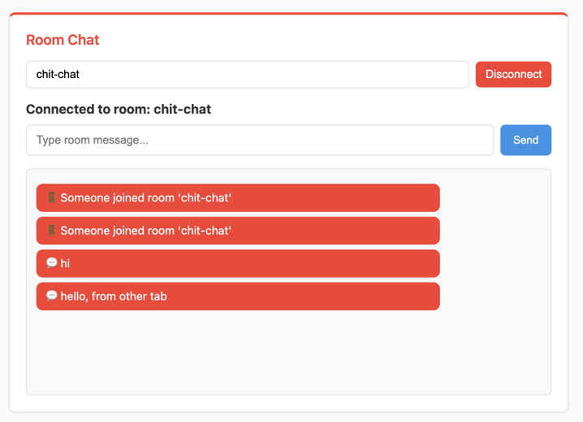

Room Chat
=========

*Multi-User Communication with Channel Layers*

In this section, we'll create a room-based chat system using channel layers. Unlike the simple echo consumer from the previous section, this consumer will enable multiple users to communicate with each other in real-time within specific chat rooms.

Understanding Channel Layers
----------------------------

Before we dive into building our room chat, let's recap what channel layers are and why they're essential for multi-user communication:

**Channel Layers** are the backbone of Fast Channels that enable communication between different WebSocket connections, even across multiple server processes. They act as a message routing system that allows:

- **Group Communication**: Send messages to multiple WebSocket connections simultaneously
- **Cross-Process Messaging**: Connect users even when they're handled by different server instances
- **Scalable Real-Time Features**: Build chat rooms, notifications, live updates, and more

**Groups** are collections of channels (WebSocket connections) that can receive messages together. When a user joins a chat room, their WebSocket connection joins a group. Messages sent to that group reach all connected users in the room.

**Dynamic Group Management** allows us to create rooms on-demand based on URL parameters. Users can join any room by visiting `/ws/room/{room_name}`, and the consumer automatically manages group membership.

Setting Up Channel Layers
-------------------------

Before we can use channel layers for room communication, we need to configure and register them. Channel layers must be set up once during application startup and before any consumers are created.

Create a new file at ``sandbox/layers.py`` to define our channel layer configuration:

.. raw:: html

   

   
<a>Channel Layers Configuration</a>

.. literalinclude:: ../../sandbox/layers.py
   :language: python

.. raw:: html

   

This configuration file:

- **Defines Multiple Layer Types**: Creates different channel layers for different purposes (chat, notifications, analytics, etc.)
- **Uses Redis Backend**: Connects to our Redis instance running on port 6399
- **Registers Layers**: Makes them available to consumers via aliases like "chat", "queue", etc.
- **Configures Different Behaviors**: Some layers use pub/sub for real-time messaging, others use queues for reliable delivery

**Important**: This setup function must be called **once** during application startup and **before** any consumers are used. If you create external scripts or background workers that use Fast Channels, they must also call ``setup_layers()`` to initialize the channel layers.

Now we need to activate this configuration in our main application. Open ``sandbox/main.py`` and uncomment these lines near the top:

.. code-block:: python

    # Uncomment these lines:
    from sandbox.layers import setup_layers
    setup_layers()

These lines import and execute our channel layer setup, making all configured layers available to our consumers.

What We're Building
-------------------

A room-based chat consumer that:

- Allows users to join specific chat rooms via URL parameters
- Broadcasts messages to all users in the same room
- Shows join/leave notifications when users connect/disconnect
- Demonstrates channel layer group communication
- Supports unlimited concurrent rooms

Creating the Room Chat Module
-----------------------------

First, let's create the room chat module structure:

.. code-block:: bash

    # Create the room_chat module directory
    mkdir -p sandbox/apps/room_chat

    # Create __init__.py file to make it a Python module
    touch sandbox/apps/room_chat/__init__.py

Your apps structure should now look like this:

.. code-block:: text

    sandbox/apps/
    ├── __init__.py
    ├── room_chat/
    │   └── __init__.py
    └── system_chat/
        ├── __init__.py
        └── consumer.py

Creating the Room Chat Consumer
-------------------------------

Now let's create our room chat consumer. Create a new file at ``sandbox/apps/room_chat/consumer.py`` and copy the consumer code from the tutorial template:

.. raw:: html

   

   
<a>Room Chat Consumer Code</a>

.. literalinclude:: ../../sandbox/tutorial/apps/room_chat/consumer.py
   :language: python

.. raw:: html

   

Understanding the Room Chat Consumer
------------------------------------

Let's break down the key concepts in this consumer:

**Channel Layer Alias:**
  ``channel_layer_alias = "chat"`` specifies which channel layer configuration to use. This references the "chat" layer we defined in our ``setup_layers()`` configuration - a Redis pub/sub layer optimized for real-time chat messaging.

**Dynamic Room Groups:**
  ``self.room_name = self.scope["path_params"]["room_name"]`` extracts the room name from the URL path (e.g., `/ws/room/general` → `room_name = "general"`)

**Group Management:**
  - ``group_add(group_name, channel_name)`` - Adds this WebSocket to a group
  - ``group_discard(group_name, channel_name)`` - Removes this WebSocket from a group
  - ``group_send(group_name, message)`` - Sends a message to all WebSockets in the group

**Message Flow:**
  1. User sends message → ``receive()`` method called
  2. Message sent to group → ``group_send()`` with type "room_message"
  3. All group members receive → ``room_message()`` method called
  4. Message delivered to each user → ``send()`` called

**Key Methods:**
  - ``connect()``: Join room group and announce arrival
  - ``disconnect()``: Leave room group and announce departure
  - ``receive()``: Broadcast user messages to room group
  - ``room_message()``: Handle messages received from the group

Integrating the Consumer
------------------------

Now we need to connect our room chat consumer to the FastAPI application. Open ``sandbox/main.py`` and uncomment these lines:

.. code-block:: python

    # Uncomment this import line:
    from sandbox.apps.room_chat.consumer import RoomChatConsumer

    # Uncomment this WebSocket route:
    ws_router.add_websocket_route("/room/{room_name}", RoomChatConsumer.as_asgi())

These lines:
  1. Import our newly created ``RoomChatConsumer``
  2. Add a WebSocket route at ``/ws/room/{room_name}`` that captures the room name as a path parameter

The route pattern ``/room/{room_name}`` creates dynamic URLs like:
  - ``/ws/room/general`` → joins "general" room
  - ``/ws/room/support`` → joins "support" room
  - ``/ws/room/team-alpha`` → joins "team-alpha" room

Testing Your Room Chat
----------------------

Your final project structure should now look like this:

.. code-block:: text

    tutorial-project/
    ├── docker-compose.yml
    └── sandbox/
        ├── __init__.py
        ├── main.py
        ├── layers.py
        ├── apps/
        │   ├── __init__.py
        │   ├── room_chat/
        │   │   ├── __init__.py
        │   │   └── consumer.py
        │   └── system_chat/
        │       ├── __init__.py
        │       └── consumer.py
        └── static/
            ├── css/
            │   └── style.css
            └── js/
                └── main.js

1. **Restart your FastAPI application:**

.. code-block:: bash

    # Stop the current server (Ctrl+C) and restart
    uvicorn sandbox.main:app --reload --port 8080

2. **Test the room chat functionality:**

Visit http://localhost:8080 in your browser. You should see the chat interface with a "Room Chat" section.

3. **Try the room features:**

- Enter a room name (e.g., "general") and click "Connect"
- Type messages and see them broadcast to the room
- Open a second browser tab/window, join the same room, and see real-time communication
- Try joining different rooms to see message isolation

**Expected Behavior:**
  - Room connection shows current room name
  - Join/leave messages appear when users connect/disconnect
  - Messages from all users in the room are visible to everyone
  - Different rooms are completely isolated from each other

Customizing Your Room Chat
--------------------------

The consumer includes several TODO items you can customize:

**1. Custom Room Group Naming:**

.. code-block:: python

    # Current: room_general, room_support
    self.room_group_name = f"room_{self.room_name}"

    # Custom: chat_general, chat_support
    self.room_group_name = f"chat_{self.room_name}"

    # Namespaced: app_v1_room_general
    self.room_group_name = f"app_v1_room_{self.room_name}"

**2. Enhanced Join/Leave Messages:**

.. code-block:: python

    # Add user information or timestamps
    import datetime
    timestamp = datetime.datetime.now().strftime("%H:%M")

    await self.channel_layer.group_send(
        self.room_group_name,
        {
            "type": "room_message",
            "message": f"🚪 [{timestamp}] User joined room '{self.room_name}'"
        }
    )

**3. Message Processing and Filtering:**

.. code-block:: python

    async def receive(self, text_data=None, bytes_data=None, **kwargs):
        # Add message validation
        if not text_data or len(text_data.strip()) == 0:
            return

        # Add user prefix or formatting
        formatted_message = f"💬 Guest: {text_data}"

        # Send to room group
        await self.channel_layer.group_send(
            self.room_group_name,
            {"type": "room_message", "message": formatted_message}
        )

**4. Room-Specific Logic:**

.. code-block:: python

    async def connect(self):
        self.room_name = self.scope["path_params"]["room_name"]

        # Add room validation
        allowed_rooms = ["general", "support", "team"]
        if self.room_name not in allowed_rooms:
            await self.close()
            return

        # Continue with normal connection...
        await self.accept()

Troubleshooting
---------------

**Room Messages Not Appearing:**
  Make sure Redis is running: ``docker compose ps``

**Users Can't See Each Other's Messages:**
  Verify both users joined the same room name (case-sensitive)

**Import Errors:**
  Ensure you uncommented both the import and route lines in ``sandbox/main.py``

**Channel Layer Not Found:**
  Check that your channel layer configuration is set up correctly (this should be handled automatically by the sandbox setup)

What's Next?
------------

Excellent! You've now built a multi-user chat system with channel layers. You understand:

✅ How channel layers enable multi-user communication

✅ Group management for organizing connections

✅ Dynamic room creation based on URL parameters

✅ Message broadcasting to multiple users simultaneously

✅ Real-time join/leave notifications

This demonstrates the power of Fast Channels for building scalable real-time applications. In the next section, we'll integrate background job processing to handle long-running tasks while providing real-time updates to users.

Continue to :doc:`background-jobs` to add background task processing with real-time updates.
