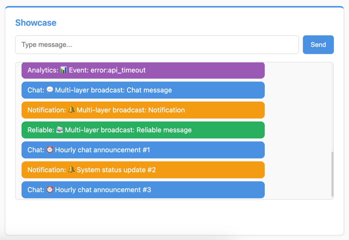

Showcase
========

*Advanced Channel Layer Patterns and External Integrations*

In this final section, we'll demonstrate advanced Fast Channels patterns by creating a comprehensive showcase that combines multiple channel layer types, different consumer implementations, and external script integrations. This showcases the full power and flexibility of Fast Channels for complex real-time applications.

Understanding Advanced Channel Layer Patterns
---------------------------------------------

**Multiple Layer Types** : Different types of communication require different channel layer configurations:
 - **Chat Layer**: Fast pub/sub for real-time chat messaging
 - **Queue Layer**: Reliable message delivery with persistence
 - **Notifications Layer**: Ephemeral notifications that don't need persistence
 - **Analytics Layer**: High-throughput event processing with reliability

**Consumer Type Variations** : Fast Channels provides different consumer base classes:
 - **AsyncWebsocketConsumer**: Basic WebSocket handling with text/binary data
 - **AsyncJsonWebsocketConsumer**: Automatic JSON encoding/decoding for structured data
 - **AsyncConsumer**: Low-level consumer for custom protocols

**External Script Integration** : Channel layers enable communication from outside the WebSocket server:
 - Background services sending notifications
 - Analytics processors publishing events
 - System maintenance scripts broadcasting announcements
 - Monitoring tools sending alerts

What We're Building
-------------------

A comprehensive showcase application featuring:

- **Multiple Consumer Types**: Different consumers using different channel layers
- **JSON vs Text Messaging**: Comparison between AsyncWebsocketConsumer and AsyncJsonWebsocketConsumer
- **Layer-Specific Behaviors**: Demonstrating pub/sub vs queue-based messaging
- **External Script Integration**: Scripts sending messages from outside the web application
- **Real-time Multi-layer Communication**: Messages flowing through different layers simultaneously

Creating the Showcase Module
----------------------------

First, let's create the showcase module structure:

.. code-block:: bash

    # Create the showcase module directory
    mkdir -p sandbox/apps/showcase

    # Create __init__.py file to make it a Python module
    touch sandbox/apps/showcase/__init__.py

Your apps structure should now look like this:

.. code-block:: text

    sandbox/apps/
    ├── __init__.py
    ├── background_jobs/
    │   ├── __init__.py
    │   └── consumer.py
    ├── room_chat/
    │   ├── __init__.py
    │   └── consumer.py
    ├── showcase/
    │   └── __init__.py
    └── system_chat/
        ├── __init__.py
        └── consumer.py

Creating the Showcase Consumers
-------------------------------

Now let's create our showcase consumers that demonstrate different patterns. Create a new file at ``sandbox/apps/showcase/consumer.py``:

.. raw:: html

   

   
<a>Showcase Consumers Code</a>

.. literalinclude:: ../../sandbox/tutorial/apps/showcase/consumer.py
   :language: python

.. raw:: html

   

Understanding the Showcase Consumers
------------------------------------

Let's examine the different patterns demonstrated:

**ChatConsumer (AsyncWebsocketConsumer):**
  - Uses "chat" layer (Redis pub/sub)
  - Text-based messaging with ``receive(text_data)``
  - Fast, ephemeral communication
  - Auto-joins "chat_room" group via ``groups`` attribute

**ReliableChatConsumer (AsyncWebsocketConsumer):**
  - Uses "queue" layer (Redis queue-based)
  - Guaranteed message delivery with persistence
  - Manual group management in connect/disconnect
  - Ideal for critical communications

**NotificationConsumer (AsyncJsonWebsocketConsumer):**
  - Uses "notifications" layer
  - **JSON-based messaging** with ``receive_json(content)`` and ``send_json(data)``
  - Structured data with type information
  - Automatic JSON encoding/decoding

**AnalyticsConsumer (Your Implementation):**
  - Uses "analytics" layer for high-throughput events
  - **Exercise for you to implement** based on the TODO hints
  - Should handle analytics events and metrics

Creating the External Script
-----------------------------

First, let's create an external script that demonstrates sending messages to WebSocket clients from outside the web application. This will show you what kinds of analytics events you'll need to handle. Create the file ``sandbox/external_sender.py``:

.. raw:: html

   

   
<a>External Script Code</a>

.. literalinclude:: ../../sandbox/external_sender.py
   :language: python

.. raw:: html

   

This external script demonstrates:

- **Multi-layer Communication**: Sends messages through different channel layers
- **External Integration**: Shows how background services can communicate with WebSocket clients
- **Layer-specific Messaging**: Different message types for different purposes
- **Periodic Operations**: Automated announcements and system notifications

Notice the ``send_analytics_event()`` function that sends various analytics events like "user_login", "page_view", "button_click", etc. This gives you a good idea of what your AnalyticsConsumer should handle.

Implementing the AnalyticsConsumer
----------------------------------

Now that you've seen what kinds of analytics events the external script sends, try implementing the AnalyticsConsumer yourself based on the TODO hints in the template. Here's the complete code for you to compare and reference:

.. raw:: html

   

   
<a>AnalyticsConsumer Implementation</a>

.. code-block:: python

    class AnalyticsConsumer(AsyncWebsocketConsumer):
        """
        Consumer for analytics events with reliable delivery.
        """

        channel_layer_alias = "analytics"
        groups = ["analytics"]

        async def connect(self):
            await self.accept()
            # Send connection confirmation
            await self.channel_layer.group_send(
                "analytics",
                {
                    "type": "analytics_message",
                    "message": "📊 Analytics tracking started!"
                },
            )

        async def receive(self, text_data=None, bytes_data=None, **kwargs):
            # Process analytics event
            await self.channel_layer.group_send(
                "analytics",
                {
                    "type": "analytics_message",
                    "message": f"📊 Analytics: {text_data}"
                },
            )

        async def disconnect(self, close_code):
            # Optional: Send disconnect analytics
            pass

        async def analytics_message(self, event):
            """Called when an analytics event is sent to the group."""
            await self.send(event["message"])

.. raw:: html

   

Integrating the Showcase Consumers
----------------------------------

Connect all showcase consumers to your FastAPI application. Open ``sandbox/main.py`` and uncomment these lines:

.. code-block:: python

    # Uncomment these import lines:
    from sandbox.apps.showcase.consumer import (
        AnalyticsConsumer,
        ChatConsumer,
        NotificationConsumer,
        ReliableChatConsumer,
    )

    # Uncomment these WebSocket routes:
    ws_router.add_websocket_route("/chat", ChatConsumer.as_asgi())
    ws_router.add_websocket_route("/reliable", ReliableChatConsumer.as_asgi())
    ws_router.add_websocket_route("/notifications", NotificationConsumer.as_asgi())
    ws_router.add_websocket_route("/analytics", AnalyticsConsumer.as_asgi())

These routes create WebSocket endpoints for each showcase consumer type.

Testing the Showcase
--------------------

Your final project structure should now look like this:

.. code-block:: text

    tutorial-project/
    ├── docker-compose.yml
    └── sandbox/
        ├── __init__.py
        ├── main.py
        ├── layers.py
        ├── tasks.py
        ├── worker.py
        ├── start_dev.py
        ├── external_sender.py
        ├── apps/
        │   ├── __init__.py
        │   ├── background_jobs/
        │   │   ├── __init__.py
        │   │   └── consumer.py
        │   ├── room_chat/
        │   │   ├── __init__.py
        │   │   └── consumer.py
        │   ├── showcase/
        │   │   ├── __init__.py
        │   │   └── consumer.py
        │   └── system_chat/
        │       ├── __init__.py
        │       └── consumer.py
        └── static/
            ├── css/
            │   └── style.css
            └── js/
                └── main.js

1. **Stop any running servers:**

If you have a server running, stop it first (Ctrl+C) to avoid conflicts.

2. **Start the development environment:**

.. code-block:: bash

    # Use the development launcher
    python sandbox/start_dev.py

3. **Test the showcase features:**

Visit http://localhost:8080 in your browser. You should see the "Showcase" section.

Try these interactions to see different layer behaviors:

- **Type in the Showcase section and press "Send"** - You'll receive messages back through both chat and reliable chat layers
- **Run the external script** in a separate terminal: ``python -m sandbox.external_sender`` - You'll see messages appear in real-time from the external script

**Expected Behavior:**
 - Messages flow through different channel layers simultaneously
 - JSON notifications have structured data format
 - External script sends messages that appear in real-time
 - Different layers show different messaging patterns

Customizing the Showcase
------------------------

**1. Adding Custom Layer Types:**

.. code-block:: python

    # In sandbox/layers.py, add new layer configurations:
    "monitoring": {
        "layer": RedisPubSubChannelLayer(hosts=[redis_url], prefix="monitor"),
        "description": "Real-time monitoring layer",
    },

**2. Creating Custom JSON Consumers:**

.. code-block:: python

    class CustomJsonConsumer(AsyncJsonWebsocketConsumer):
        async def receive_json(self, content, **kwargs):
            # Handle structured data
            message_type = content.get("type")
            payload = content.get("payload")

            if message_type == "user_action":
                await self.handle_user_action(payload)
            elif message_type == "system_event":
                await self.handle_system_event(payload)

**3. Advanced External Scripts:**

.. code-block:: python

    # Create monitoring script
    async def send_monitoring_alert():
        layer = get_channel_layer("monitoring")
        await layer.group_send(
            "alerts",
            {
                "type": "alert_message",
                "data": {
                    "severity": "high",
                    "message": "CPU usage above 90%",
                    "timestamp": time.time()
                }
            }
        )

**4. Cross-Layer Communication:**

.. code-block:: python

    async def broadcast_to_all_layers(message):
        """Send message to multiple layer types simultaneously."""
        layers = ["chat", "notifications", "analytics"]

        for layer_name in layers:
            layer = get_channel_layer(layer_name)
            if layer:
                await layer.group_send(
                    f"{layer_name}_group",
                    {"type": f"{layer_name}_message", "message": message}
                )

Troubleshooting
---------------

**External Script Not Working:**
  Ensure Redis is running and channel layers are set up: ``docker compose ps``

**JSON Messages Not Parsing:**
  Check that you're sending valid JSON to AsyncJsonWebsocketConsumer endpoints

**Messages Not Appearing:**
  Verify all imports and routes are uncommented in ``sandbox/main.py``

**Layer Connection Issues:**
  Ensure ``setup_layers()`` is called before any channel layer operations

**External Script Import Errors:**
  Make sure you're running the script from the project root directory

What You've Accomplished
------------------------

Congratulations! You've now mastered Fast Channels and built a comprehensive real-time application. You understand:

✅ **Multiple Channel Layer Types**: Pub/sub, queue-based, and specialized layers

✅ **Advanced Consumer Patterns**: Text vs JSON consumers and their use cases

✅ **External Script Integration**: Sending messages from outside the web application

✅ **Cross-Process Communication**: Coordinating between different services and scripts

✅ **Production-Ready Patterns**: Scalable architectures using different layer types

✅ **Real-time Application Development**: Complete workflow from simple echo to complex multi-layer systems

References
----------

**Learning Resources:**
 - Explore the complete `/sandbox <https://github.com/huynguyengl99/fast-channels/tree/main/sandbox>`_ code for more examples
 - Read the Fast Channels documentation for advanced configuration options
 - Study Django Channels patterns that inspired Fast Channels design

Thank you for completing the Fast Channels tutorial! You're now ready to build powerful, scalable real-time applications with confidence.
