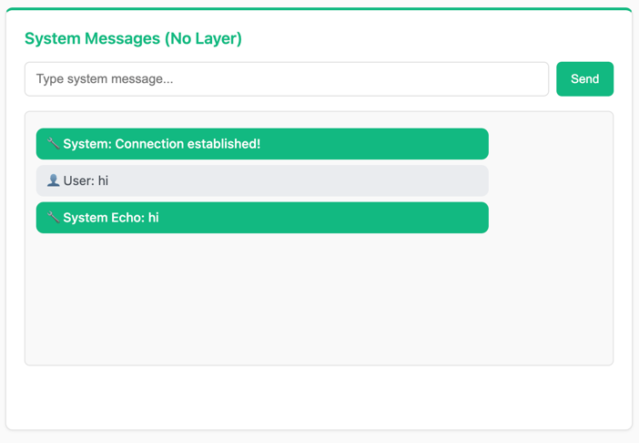

System Messages
===============

*Your First WebSocket Consumer*

In this section, we'll create your first WebSocket consumer that handles simple client-server communication. This consumer will echo back whatever message the client sends, demonstrating the basics of WebSocket handling without channel layers.

What We're Building
-------------------

A simple echo WebSocket consumer that:

- Accepts WebSocket connections from clients
- Receives messages from the client
- Echoes the message back with a server prefix
- Handles connection and disconnection events

This is the simplest form of WebSocket communication - direct server-client messaging without any channel layer complexity.

Creating the App Structure
--------------------------

First, let's organize our code by creating a modular app structure. This will help us separate different features as we build them.

Create the apps module structure:

.. code-block:: bash

    # Create the apps module directory
    mkdir -p sandbox/apps/system_chat

    # Create __init__.py files to make them Python modules
    touch sandbox/apps/__init__.py
    touch sandbox/apps/system_chat/__init__.py

Your project structure should now look like this:

.. code-block:: text

    tutorial-project/
    ├── docker-compose.yml
    └── sandbox/
        ├── __init__.py
        ├── main.py
        ├── apps/
        │   ├── __init__.py
        │   └── system_chat/
        │       └── __init__.py
        └── static/
            ├── css/
            │   └── style.css
            └── js/
            │   └── main.js

Creating the System Message Consumer
------------------------------------

Now let's create our first WebSocket consumer. Copy the consumer code from the tutorial template:

.. raw:: html

   

   
<a>System Chat Consumer Code</a>

.. literalinclude:: ../../sandbox/tutorial/apps/system_chat/consumer.py
   :language: python

.. raw:: html

   

Create this file at ``sandbox/apps/system_chat/consumer.py`` with the content above.

Understanding the Consumer
--------------------------

Let's break down what this consumer does:

**AsyncWebsocketConsumer Class:**
  The base class for handling WebSocket connections. It provides methods for managing the WebSocket lifecycle.

**connect() method:**
  Called when a client establishes a WebSocket connection. We accept the connection using ``await self.accept()``.

**disconnect() method:**
  Called when the WebSocket connection is closed. We can perform cleanup here if needed.

**receive() method:**
  Called whenever the client sends a message. We receive the text, add a server prefix, and echo it back using ``await self.send()``.

**Key Points:**
 - All methods are async and use ``await`` for I/O operations
 - ``self.accept()`` must be called to establish the connection
 - ``self.send()`` sends messages back to the client
 - No channel layers needed for direct client-server communication

Customizing the Echo Response
-----------------------------

The current consumer echoes back messages with a "Server echo: " prefix. Try modifying the response in the ``receive()`` method:

.. code-block:: python

    async def receive(self, text_data):
        # Try different response formats:

        # Option 1: Add timestamp
        import datetime
        timestamp = datetime.datetime.now().strftime("%H:%M:%S")
        response = f"[{timestamp}] Server received: {text_data}"

        # Option 2: Transform the message
        response = f"You said: '{text_data}' - Message received loud and clear!"

        # Option 3: Simple echo with different prefix
        response = f"Echo: {text_data}"

        await self.send(text_data=response)

Feel free to experiment with different response formats to see how the WebSocket communication works.

Integrating the Consumer
------------------------

Now we need to connect our consumer to the FastAPI application. Open ``sandbox/main.py`` and uncomment these lines:

.. code-block:: python

    # Uncomment this import line:
    from sandbox.apps.system_chat.consumer import SystemMessageConsumer

    # Uncomment this WebSocket route:
    ws_router.add_websocket_route("/system", SystemMessageConsumer.as_asgi())

These lines:
 1. Import our newly created ``SystemMessageConsumer``
 2. Add a WebSocket route at ``/ws/system`` that uses our consumer

Testing Your System Messages
----------------------------

Your final project structure should now look like this:

.. code-block:: text

    tutorial-project/
    ├── docker-compose.yml
    └── sandbox/
        ├── __init__.py
        ├── main.py
        ├── apps/
        │   ├── __init__.py
        │   └── system_chat/
        │       ├── __init__.py
        │       └── consumer.py
        └── static/
            ├── css/
            │   └── style.css
            └── js/
                └── main.js

1. **Restart your FastAPI application:**

.. code-block:: bash

    # Stop the current server (Ctrl+C) and restart
    uvicorn sandbox.main:app --reload --port 8080

2. **Test the WebSocket connection:**

Visit http://localhost:8080 in your browser. You should see the chat interface with a "System Messages" section.

3. **Try sending messages:**

- Type a message in the "System Messages" input box
- Click "Send" or press Enter
- You should see your message echoed back with the server prefix

**Expected Behavior:**
 - Your message appears as "User: [your message]"
 - Server response appears as "System Echo: [your message]"
 - Connection status shows "Connection established!" when WebSocket connects

Troubleshooting
---------------

**WebSocket Connection Failed:**
  Make sure you uncommented both the import and the route lines in ``sandbox/main.py``

**Server Not Restarting:**
  If using ``--reload``, the server should restart automatically. If not, manually stop (Ctrl+C) and restart.

**Import Errors:**
  Ensure all ``__init__.py`` files are created and the file paths match exactly.

**No Messages Appearing:**
  Check the browser console (F12) for JavaScript errors.

What's Next?
------------

Congratulations! You've created your first WebSocket consumer. You now understand:

✅ How to create a basic WebSocket consumer

✅ The WebSocket lifecycle (connect, receive, disconnect)

✅ Direct client-server messaging without channel layers

✅ How to organize code with modular app structure

This is the foundation of real-time communication in Fast Channels. In the next section, we'll add channel layers to enable communication between multiple clients in chat rooms.

Continue to :doc:`room-chat` to build multi-room chat functionality.
